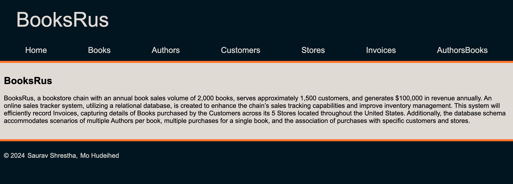
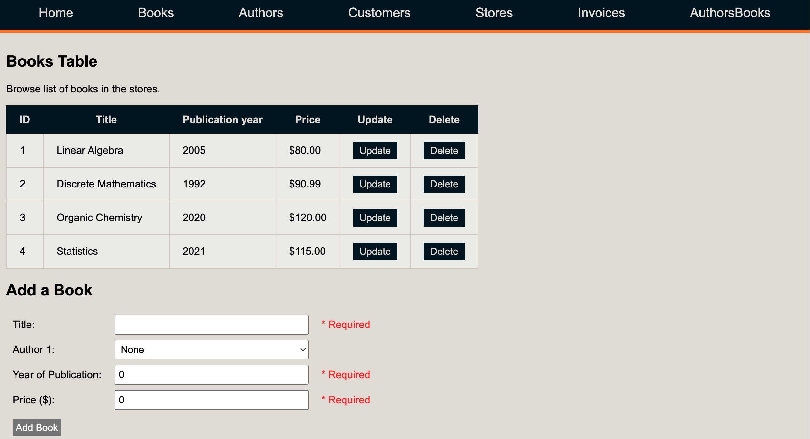
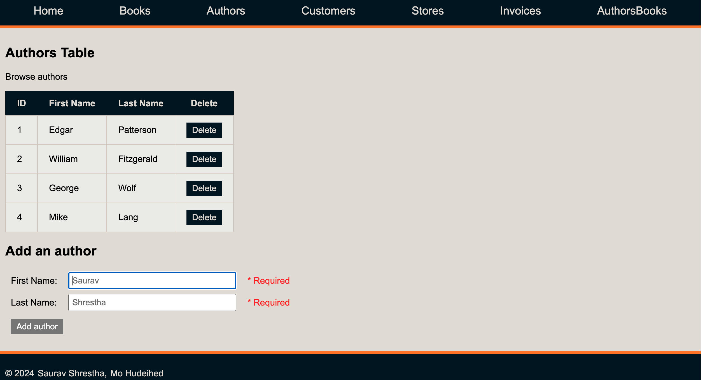
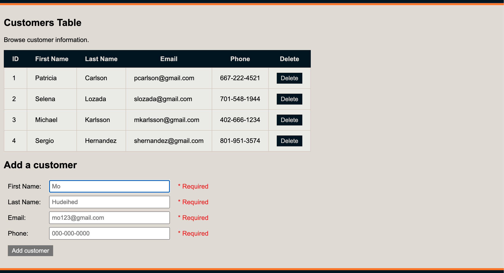
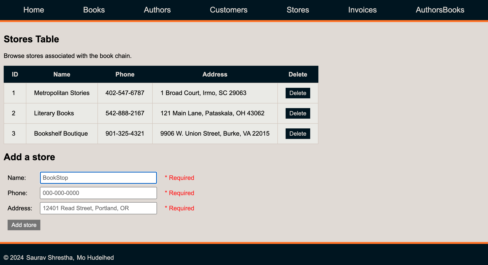
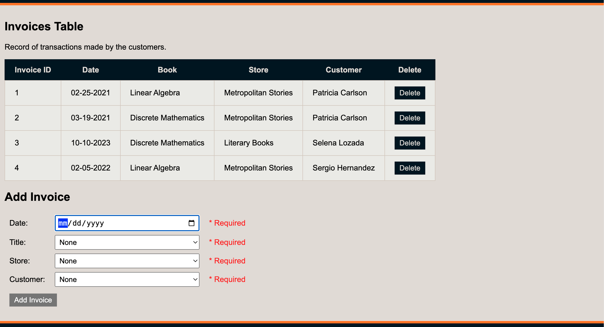
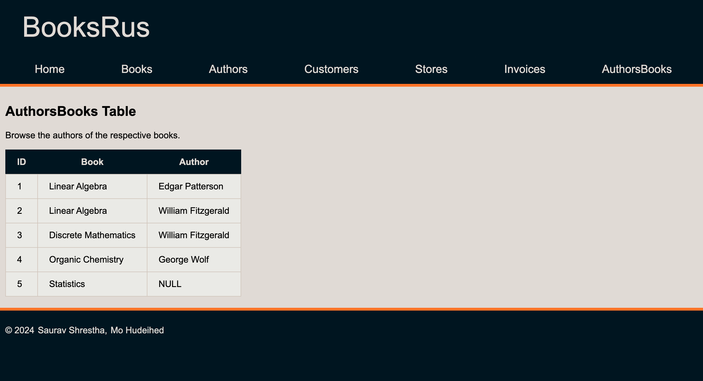

# BooksRus Database

The BooksRus’ database frontend project is now complete. We’ve developed the architecture of BooksRus' database step-by-step and fine-tuned the design to adopt a more efficient and logical approach to storing essential data for the bookstore chain's operations.

> [!NOTE]
> Each directory called "Step X" showcaes the project at a different stage of the development process. Step 6 is the most recent and complete version.

- [Project Screenshots](#project-screenshots)
  - [Home Page](#home-page)
  - [Books](#books)
  - [Authors](#authors)
  - [Customers](#customers)
  - [Stores](#stores)
  - [Invoices](#invoices)
  - [AuthorsBooks](#authorsbooks)
- [Entity Relationship Diagram (ERD)](#entity-relationship-diagram-erd)
- [Database Schema](#database-schema)

## Project Screenshots

### Home Page

### Books

### Authors

### Customers

### Stores

### Invoices

### AuthorsBooks

## Entity Relationship Diagram (ERD)

## Database Schema

